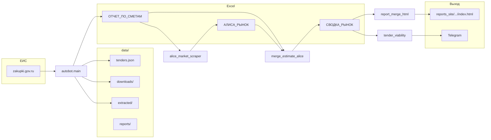

# Auto_bot: концепт и архитектура

Документ для людей и для агента в Cursor: **сначала смотри сюда**, если трогаешь пайплайн, отчёты, Алису или Telegram.

## Зачем проект

Сбор тендеров с **zakupki.gov.ru**, скачивание документов, извлечение **сметы** (работы, объёмы, цены) в Excel, затем **рыночные ориентиры** через веб-**Алису** (цены, телефоны, ссылки), **склейка** смета + рынок, **HTML-отчёт** и уведомления в **Telegram**. Веб-UI для просмотра и ручного запуска шагов.

## Расположение в репозитории

| Путь | Назначение |
|------|------------|
| **`autobot/`** | Весь прикладной Python: парсинг, веб, Алиса, merge, отчёты, TG |
| **`autobot/paths.py`** | `REPO_ROOT` (корень репо), `DATA_DIR`, `REPORTS_DIR` — пути к `data/` |
| **`docs/`** | Документация: этот файл, **[COMMANDS.md](./COMMANDS.md)** (шпаргалка запуска) |
| **`tools/`** | Расписание (`install_scheduled_tasks.ps1`, `install_cron_tasks.sh`), лаунчеры (`launch_web_ui.py`, `launch_scheduled_pipeline.py`, `run_module.py`, `run_alice.py`), `run_alice.cmd` |
| **`botctl.py`** | В корне: `install` / `remove` / `run-now` / `web` → вызывает скрипты из `tools/` |

Запуск **из корня репозитория** (рабочая директория = корень). Лаунчеры в `tools/` добавляют корень в `sys.path`: при **`py -3`** с изоляцией окружения команды вида **`py -3 -m autobot…`** и **`PYTHONPATH`** часто не работают — используйте **`tools/run_module.py`** или тонкие **`tools/launch_*.py`**.

```text
py -3 botctl.py web
py -3 tools/launch_web_ui.py
py -3 tools/launch_scheduled_pipeline.py
py -3 tools/run_module.py autobot.main --help
py -3 tools/run_alice.py --help
py -3 tools/run_module.py autobot.merge_estimate_alice --tender-id <id>
```

## Точки входа (модули)

| Модуль | Роль |
|--------|------|
| `autobot.main` | Парсинг ЕИС, выгрузки, `ОТЧЕТ_ПО_СМЕТАМ_<id>.xlsx` |
| `autobot.scheduled_pipeline` | Регламент: main → Алиса → merge → HTML → TG |
| `autobot.web_ui` | Flask: список тендеров, API, `/merge-report/<id>/` |
| `autobot.alice_market_scraper` | Playwright → Алиса по строкам сметы, `АЛИСА_РЫНОК_*.xlsx` |
| `autobot.merge_estimate_alice` | Склейка `ОТЧЕТ` + `АЛИСА` → `СВОДКА_РЫНОК_<id>.xlsx` |
| `autobot.report_merge_html` | `СВОДКА` → `data/reports_site/<id>/index.html` |
| `autobot.serve_report_site` | Опционально: только статика `reports_site` без Flask |
| `tools/run_alice.cmd` | `cd` в корень репо + `py -3 tools/run_alice.py …` |

Установка расписания: **`tools/install_scheduled_tasks.ps1`** или **`tools/install_cron_tasks.sh`** (рабочая директория задачи = корень репо).

## Поток данных (упрощённо)



## Каталог `data/`

- `tenders.json` — метаданные и URL тендеров  
- `downloads/<tender_id>/` — сырые файлы с площадки  
- `extracted/<tender_id>/` — распаковка  
- `reports/` — `ОТЧЕТ_ПО_СМЕТАМ_<id>.xlsx`, `АЛИСА_РЫНОК_*.xlsx`, итоговые HTML смет при необходимости  
- `reports_site/<tender_id>/index.html` — сводный веб-отчёт (смета + Алиса + сравнение)  
- `alice_playwright_profile/` — профиль Chromium для Алисы  
- `logs/` — логи пайплайна и прочее  

Пути к `data/` задаются в **`autobot/paths.py`** и переиспользуются в **`autobot/report_prompt.py`** (`DATA_DIR`, `REPORTS_DIR`, `BASE_DIR` = `REPO_ROOT`).

## Модули по слоям

**Парсинг и смета**

- `autobot/main.py` — оркестратор ЕИС, вызовы загрузчиков/парсеров смет.  
- `autobot/market_analytics.py` — колонки, нормализация сметы, извлечение сумм, пересчёты для merge/отчёта.

**Рынок (Алиса)**

- `autobot/alice_market_scraper.py` — запросы к Алисе, парсинг блоков `ЦЕНЫ_РУБ` / `ИСТОЧНИКИ`, колонки Excel.  
- `autobot/text_contacts.py` — общее извлечение URL и телефонов.

**Склейка и отчёт**

- `autobot/merge_estimate_alice.py` — join по нормализованному названию работы, колонки рынка.  
- `autobot/report_merge_html.py` — таблицы «Сравнение / Алиса / Смета», бандл цена·телефон·сайт.  
- `autobot/report_prompt.py` — `DATA_DIR`/`REPORTS_DIR`, метаданные (`load_tender_metadata`).

**Оценка и AI**

- `autobot/tender_viability.py` — метрики, HTML в отчёте, `format_viability_for_telegram`.  
- `autobot/analytics_openai.py` — опциональные тексты OpenAI.

**Инфраструктура**

- `autobot/telegram_notify.py` — доставка в Telegram.  
- `autobot/site_public_url.py` — публичный URL для ссылок.  
- `autobot/tender_notifications.py` — карточка нового тендера после main.

## Зависимости между модулями (важное)

- `autobot.web_ui` — subprocess `tools/run_module.py autobot.main` / `… autobot.alice_market_scraper`; merge и HTML через импорт функций.  
- `autobot.scheduled_pipeline` — то же через `run_module.py`, `cwd=REPO_ROOT`.  
- `autobot.report_merge_html` тянет `market_analytics`, `merge_estimate_alice`, `report_prompt`, `text_contacts`.  
- `autobot.alice_market_scraper` тянет `merge_estimate_alice._norm_key`, `market_analytics`, `report_prompt`.

## Переменные окружения

См. **`.env.example`**: токены Telegram, прокси для TG, `REPORT_SITE_PUBLIC_BASE_URL`, расписание `PIPELINE_SCHEDULE_*`, флаги `RUN_ALICE`, `TELEGRAM_SEND_MERGE_EXCEL`, настройки Алисы и OpenAI.

## Что не трогать без нужды

- Селекторы ЕИС и Алисы ломаются от вёрстки — правки точечно.  
- Имена колонок в `merge_estimate_alice` / Excel должны оставаться согласованными с `report_merge_html` и `web_ui`.

## README.md

Короткий пользовательский README; детали пайплайна и актуальные пути к файлам — **в этом документе**. При смене потока данных имеет смысл обновить и README, и эту секцию.

---

*Последнее обновление структуры документа: по состоянию репозитория auto_bot (смета + Алиса + merge + web + TG).*
